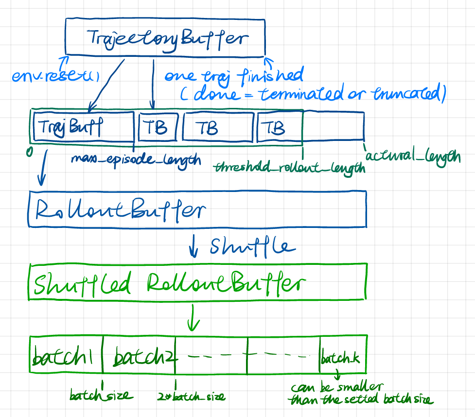
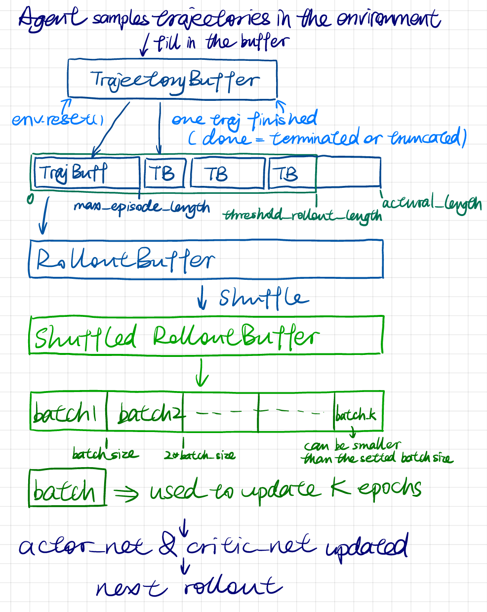

# Documentation

## Design

### Overview

```bash
rl_trainkit/
├── __init__.py
├── networks.py     # neural network modules
├── buffers.py      # buffer modules to store rollouts
├── ppo_agent.py    # Core PPO algorithm logic, take actions and update networks
├── trainers.py     # Trainer class to manage the training process
└── utils.py        # utility functions (e.g., logging, visualization)
```

### PPOClip (in `ppo_agent.py`)

#### Update after a rollout

```python
for epoch in num_update_epochs:
  for batch in batchs_from_shuffled_rollout_buffer:
    update_with_the_batch
```

#### Update with a batch

- move the batch to device
- calculate log_probabilities and values for the steps in the batch, with current policy and value networks
- loss for updating actor network:
  - calculate the `clipped_ratio`, which is the core of PPO-clip algorithm
  - calculate critic_loss
- loss for updating critic network:
  - calculate the `value_pred_clipped`,
  - calculate the `value_loss_unclipped` and `value_loss_clipped`
  - take the maximum of the two value losses
- backpropagation, update actor and critic networks

### Buffers (in `buffers.py`)

<p align="center">
    
</p>

<p align="center">
    
</p>

### Training pipline

<p align="center">
    
</p>

## Output

### Verbose log

```
===================================
ROLLOUT STATISTICS
-----------------------------------
  mean_ep_len:        mean length of the episodes in this rollout
  mean_ep_return:     mean return of the episodes in this rollout
  mean_reward:        mean reward of the episodes in this rollout
  mean_clipped_ratio: mean clipped ratio of the episodes in this rollout
  approx_kl:          approximate KL divergence between old and new policy
  rollout_len:        total length of the rollout
  time_elapsed:       time elapsed for this rollout

RECENT N EPISODES
-----------------------------------
  mean_ep_len:        mean length of the latest N episodes
  mean_ep_return:     mean return of the latest N episodes
  success_rate:       success rate of the latest N episodes (num_terminated/N)

TRAINER STATISTICS
-----------------------------------
  episodes_count:     number of episodes that have been rolled out
  timesteps_count:    number of timesteps passed after this rollout
  rollouts_count:     number of rollouts that have been performed
  total_timesteps:    total number of timesteps set for the trainer
  clip_range:         clip range set for the PPO-clip algorithm
===================================
```

### Models

```python
# functions to save the models
agent = PPOClip()
agent.save_policy_net(path_for_policy_model)
agent.save_value_net(path_for_value_model)
```

- `best_return_pi_ckpt`: the policy model which achieved highest return (average return in the recent_episodes_window)
- `pi_ckpt{i}`: the policy model saved at the checkpoint timesteps (number of checkpoints is set by `num_checkpoints` parameter of the trainer)
- `final_actor.pth`: the final policy model after training
- `final_critic.pth`: the final value model after training